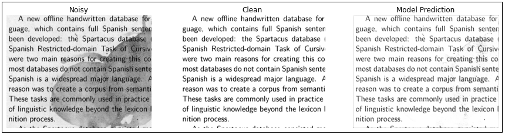
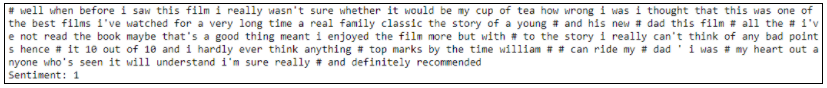
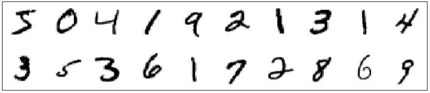

<kbd>

</kbd>
    
<kbd>

</kbd>

<kbd>

</kbd>

# Hello there!

Welcome to my GitHub page.

## Technology & Tools

 

## My Work
To know more about my work, follow to my repositories.  
1. Denoising images (Autoencoders | CNNs)
    

2. Sentiment Analysis on movie reviews (RNNs(LSTM))
    
    
3. Image Classifier on MNIST handwritten digits (Supervised Learning | Data Augmentation | Model Stacking)
    

## Contact Me
<kbd>

</kbd>
    
<kbd>

</kbd>

<kbd>

</kbd>

<!-- 
Links
https://github.com/edent/SuperTinyIcons/blob/master/README.md
https://github.com/carlsednaoui/gitsocial

-->

<!--
https://towardsdatascience.com/build-a-stunning-readme-for-your-github-profile-9b80434fe5d7
- 👋 Hi, I’m @shubhamkaushal765, or Shubham Kaushal
- 👀 I’m interested in Data Science and Applied Machine Learning.
- 🌱 I’m currently learning Advanced Neural Networks.
- 💞️ I’m looking to collaborate on projects related to Machine Learning.
- 📫 How to reach me ...  
          - Email: shubhamkaushal765@gmail.com  
          - GitHub: https://github.com/shubhamkaushal765  
          - LinkedIn: https://www.linkedin.com/in/kaushalshubham/

shubhamkaushal765/shubhamkaushal765 is a ✨ special ✨ repository because its `README.md` (this file) appears on your GitHub profile.
You can click the Preview link to take a look at your changes.
--->
